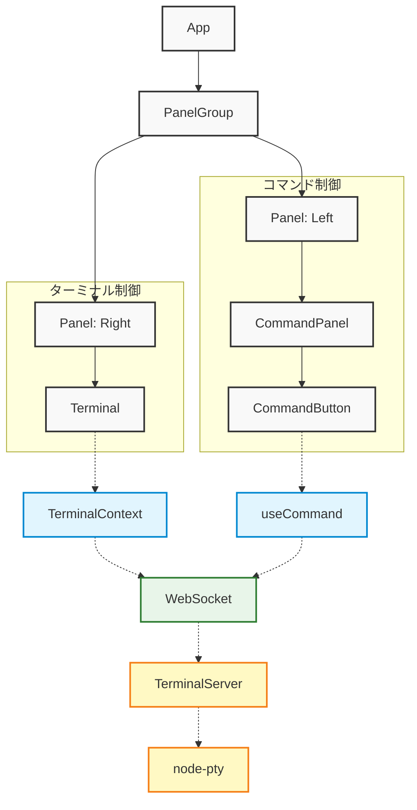
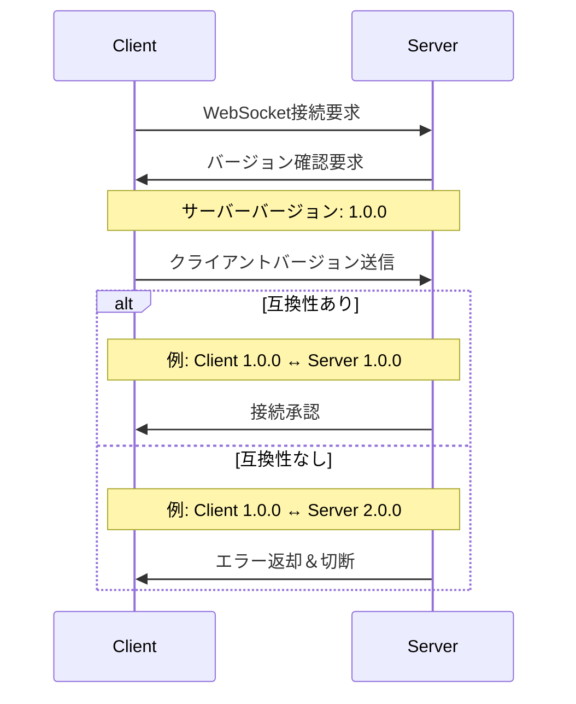

# ExecDock 開発者ガイド

## プロジェクト構成

```
ExecDock/
├── electron-builder.yml   # Electron Builder設定
├── electron.vite.config.ts # Electron Vite設定
├── package.json          # プロジェクト依存関係
├── tsconfig.json         # TypeScript設定（共通）
├── tsconfig.node.json    # TypeScript設定（Node向け）
├── tsconfig.web.json     # TypeScript設定（Web向け）
├── vite.web.config.ts    # Web向けVite設定
├── eslint.config.mjs     # ESLintの設定
├── build/                # ビルドリソース
│   ├── icon.icns        # macOS用アイコン
│   ├── icon.ico         # Windows用アイコン
│   └── icon.png         # 共通アイコン
├── resources/           # アプリケーションリソース
└── src/                 # ソースコード
    ├── config/         # 共通設定
    │   └── logger.ts   # ログ設定
    ├── main/          # Electronのメインプロセス
    │   └── index.ts   # メインエントリーポイント
    ├── renderer/      # 共通UI（Electron/Web）
    │   ├── index.html   # メインHTML
    │   └── src/         # フロントエンドコード
    │       ├── App.tsx  # ルートコンポーネント
    │       ├── main.tsx # エントリーポイント
    │       ├── assets/  # 静的アセット
    │       ├── components/ # Reactコンポーネント
    │       │   ├── Command/ # コマンド関連コンポーネント
    │       │   └── Terminal/ # ターミナル関連コンポーネント
    │       ├── config/   # 設定ファイル
    │       ├── contexts/ # Reactコンテキスト
    │       ├── hooks/    # カスタムフック
    │       ├── services/ # サービス層
    │       └── types/    # 型定義
    └── server/          # Web版バックエンド
        ├── main.ts      # サーバーエントリーポイント
        ├── package.json # サーバー依存関係
        ├── pnpm-lock.yaml # サーバーロックファイル
        └── tsconfig.json # TypeScript設定
```

## コンポーネント構成



## データフロー

1. ターミナル初期化フロー
   ```mermaid
   sequenceDiagram
       participant T as Terminal Component
       participant TC as TerminalContext
       participant XTerm as xterm.js
       participant WS as WebSocket
       participant TS as TerminalServer
       participant PTY as node-pty

       T->>TC: コンテナ要素を渡す
       TC->>XTerm: ターミナルインスタンス作成
       TC->>XTerm: アドオン読み込み
       TC->>WS: WebSocket接続
       WS->>TS: 接続確立
       TS->>PTY: ターミナルプロセス生成
       TS->>WS: 準備完了通知
       WS->>TC: 初期化完了
   ```

2. コマンド実行フロー
   ```mermaid
   sequenceDiagram
       participant U as User
       participant CB as CommandButton
       participant T as Terminal
       participant TC as TerminalContext
       participant WS as WebSocket
       participant TS as TerminalServer
       participant PTY as node-pty

       Note over U,PTY: パターン1: コマンドボタンクリック
       U->>CB: クリックイベント
       CB->>TC: executeCommand呼び出し
       TC->>WS: コマンド送信
       WS->>TS: メッセージ転送
       TS->>PTY: コマンド実行
       PTY->>TS: 実行結果
       TS->>WS: output送信
       WS->>TC: データ受信
       TC->>T: 結果表示

       Note over U,PTY: パターン2: キーボード入力
       U->>T: コマンド入力
       U->>T: Enterキー押下
       T->>TC: データ送信
       TC->>WS: input送信
       WS->>TS: メッセージ転送
       TS->>PTY: コマンド実行
       PTY->>TS: 実行結果
       TS->>WS: output送信
       WS->>TC: データ受信
       TC->>T: 結果表示
   ```

## 主要コンポーネントと機能

### 通信アーキテクチャ
- WebSocketベースの双方向通信
  - Electron版とWeb版で統一された通信方式
  - ポート8999でWebSocketサーバーを起動
  - メッセージタイプによるコマンド制御
    - terminal: ターミナル操作
    - native: ElectronネイティブAPI呼び出し
- メインプロセス（main/index.ts）
  - WebSocketサーバーの管理
  - node-ptyプロセスの制御
- レンダラープロセス（renderer/）
  - Reactベースのユーザーインターフェース
  - WebSocketクライアントの管理

### フロントエンドコンポーネント

#### App.tsx
- アプリケーションのルートコンポーネント
- react-resizable-panelsによる画面分割
- コマンド定義の管理
- TerminalProviderによるコンテキスト提供

#### Terminal.tsx
- シンプルなコンテナコンポーネント
- ターミナル要素のマウントポイント提供
- 初期化状態に応じたローディング表示
- すべてのロジックをTerminalContextに委譲

#### CommandEditModal.tsx
- コマンド設定の編集用モーダルダイアログ
- YAML形式でのコマンド定義編集
- ファイルインポート/エクスポート機能
- バリデーション機能とエラー表示
- 設定の永続化（localStorageへの保存）

#### TerminalContext.tsx
- ターミナルの状態管理
- xterm.jsインスタンスの初期化と管理
- WebSocket通信の確立と管理
  - 自動再接続機能
  - エラーハンドリング
  - メッセージの送受信
- リサイズ処理の最適化
- 各種アドオンの初期化と管理
  - FitAddon: サイズ自動調整
  - SearchAddon: テキスト検索
  - WebLinksAddon: URLの自動リンク化
  - Unicode11Addon: Unicode 11サポート
  - SerializeAddon: ターミナル状態のシリアライズ

### カスタムフック

#### useCommand.ts
- コマンド実行ロジック
- WebSocket経由でのコマンド送信
- コマンド履歴の管理

### バックエンド（サーバー）
- WebSocket通信
  - クライアント接続の管理
  - メッセージの送受信
  - 自動再接続機能
- TerminalServer
  - PTYプロセスの管理
  - 入出力のストリーミング
  - エラー処理と復旧
- ログシステム
  - 環境変数によるログレベル制御
  - カテゴリ別ログ出力
    - terminal: 入出力/リサイズ
    - websocket: 接続/メッセージ
    - debug: システム全般
  - 開発時のみ詳細ログを出力

## 開発環境

### Electronアプリケーション開発
- Electron Viteによるホットリロード
- TypeScriptのコンパイル
- アセットの最適化
- メインプロセスとレンダラープロセスの同時開発

### 開発サーバー（localhost:8999、開発時のみ使用）
- WebSocket通信
- シェルプロセスの管理
- 静的ファイルの配信

## ビルドプロセス

### 依存関係のインストール
```bash
# メインアプリケーションの依存関係をインストール
pnpm install
```

### 開発環境の起動
- Electron版開発モード:
  ```bash
  pnpm dev
  ```
- Web版フロントエンド開発:
  ```bash
  # サーバー側の依存関係をインストール（必須）
  cd src/server
  pnpm install
  cd ../..

  # node-pty モジュールを再ビルド
  pnpm rebuild
  pnpm web:dev
  ```
- Web版バックエンド開発:
  ```bash
  pnpm server:dev
  ```
  **注意**: サーバーを起動する前に、 `src/server` ディレクトリで `pnpm install` を実行してください。

- Web版フル開発環境（フロントエンド + バックエンド）:
  ```bash
  pnpm web:full-dev
  ```

### ビルド
- Electron版ビルド:
  ```bash
  pnpm build
  ```
- Web版ビルド:
  ```bash
  pnpm web:build  # フロントエンドのビルド
  pnpm server:build  # バックエンドのビルド
  ```

## バージョン管理

### バージョン形式
アプリケーションは以下のセマンティックバージョニングを採用しています：
```
major.minor.patch
```
- major: 破壊的変更を含むバージョン
- minor: 後方互換性のある機能追加
- patch: バグ修正

### バージョン管理の仕組み

1. 設定ファイル
```bash
# .env - 環境変数でバージョンを一元管理
VITE_APP_VERSION=1.0.0

# package.json - npmパッケージとしてのバージョン
{
  "name": "execdock",
  "version": "1.0.0",
  ...
}
```

2. 実装方式
```typescript
// クライアント側（TerminalContext）
const getClientVersion = (): VersionInfo => {
  const versionStr = import.meta.env.VITE_APP_VERSION;
  const [major, minor, patch] = versionStr.split('.').map(Number);
  return { major, minor, patch };
};

// サーバー側（shared/shared.ts）
const getAppVersion = (): VersionInfo => {
  const versionStr = process.env.VITE_APP_VERSION;
  const [major, minor, patch] = versionStr.split('.').map(Number);
  return { major, minor, patch };
};
```

3. バージョン互換性フロー


4. 互換性ルール
```typescript
function isCompatibleVersion(client: VersionInfo, server: VersionInfo): boolean {
  // メジャーバージョンは完全一致が必要
  if (client.major !== server.major) return false;
  // クライアントのマイナーバージョンはサーバー以上である必要がある
  if (client.minor < server.minor) return false;
  return true;
}
```

### バージョン更新手順

1. 変更の種類を判断
   - 破壊的変更 → メジャーバージョン更新
   ```bash
   # 例: 1.0.0 → 2.0.0
   ```
   - 新機能追加 → マイナーバージョン更新
   ```bash
   # 例: 1.0.0 → 1.1.0
   ```
   - バグ修正 → パッチバージョン更新
   ```bash
   # 例: 1.0.0 → 1.0.1
   ```

2. バージョンの更新
   ```bash
   # 1. .envファイルのバージョンを更新
   VITE_APP_VERSION=x.y.z

   # 2. package.jsonのバージョンを更新（自動的にgitタグも作成）
   pnpm version x.y.z
   ```

3. 変更のコミット
   ```bash
   # バージョン関連ファイルの変更をコミット
   git add .env package.json
   git commit -m "chore: bump version to x.y.z"
   
   # 必要に応じてタグをプッシュ
   git push --tags
   ```

### バージョン管理のベストプラクティス

1. バージョン一貫性の維持
   - .envとpackage.jsonのバージョンを常に同期
   - gitタグでバージョンを明示的に管理
   - リリースノートと変更履歴の更新

2. 互換性の考慮
   - メジャーバージョンの変更は慎重に判断
   - 後方互換性を可能な限り維持
   - 互換性に影響する変更は明確に文書化

3. デプロイメント
   - ステージング環境でのバージョン確認
   - クライアント/サーバー間の互換性テスト
   - ロールバック手順の準備

### 依存関係のバージョン管理

TypeScriptとNode.js関連の依存関係は、クライアントとサーバー間で以下のバージョンに統一されています：

- typescript: ^5.3.3
- @types/node: ^20.11.19
- Node.js: 20.19.0 (engines設定)

これらのバージョンは安定性を重視して選択されています。

### Electron アプリケーションのパッケージング
```bash
# Windows向けビルド
pnpm build:win

# macOS向けビルド
pnpm build:mac

# Linux向けビルド
pnpm build:linux

# 全プラットフォーム向けビルド
pnpm build:all
```

これにより、`dist`ディレクトリに各プラットフォーム向けの実行可能ファイルが生成されます。

### 対応プラットフォーム
- macOS (x64, arm64)
- Windows
- Linux

## デバッグ

### クライアントサイド（フロントエンド）
- DevTools
  - React Devtools統合
  - パフォーマンスプロファイリング
  - ネットワーク監視（WebSocket通信）
- コンソールログ
  - WebSocketメッセージの追跡
  - ターミナル操作のトレース
  - エラー・警告の表示

### サーバーサイド
- ログレベルの切り替え
  ```bash
  # 開発時のフルログ
  NODE_ENV=development pnpm dev

  # 本番環境用の最小ログ
  NODE_ENV=production pnpm dev
  ```
- カテゴリ別ログ出力
  - terminal: ターミナルの入出力とリサイズ
  - websocket: 接続とメッセージング
  - debug: システム全般の詳細ログ
- エラーと例外のトレース

## 設定オプション

### ターミナル設定（TerminalContext.tsx）
- cols: 初期列数（デフォルト: 80）
- rows: 初期行数（デフォルト: 24）
- fontFamily: フォント（デフォルト: monospace）
- fontSize: フォントサイズ（デフォルト: 14）
- theme: カラーテーマ設定
  - background: 背景色
  - foreground: 文字色
  - cursor: カーソル色
  - selection: 選択範囲の色

### Electron設定
- ウィンドウサイズ: 初期サイズと最小サイズ
- アプリケーションメニュー
- システムトレイ統合
- ショートカットキー
