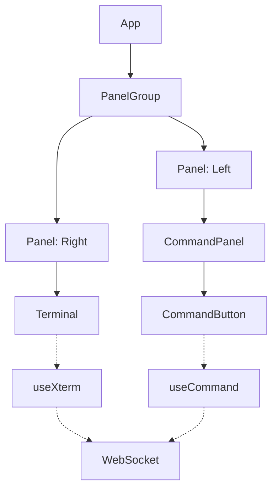

# ExecDock 開発者ガイド

## プロジェクト構成

```
ExecDock/
├── client/                    # フロントエンド
│   ├── index.html            # メインHTML
│   ├── package.json          # フロントエンド依存関係
│   ├── tsconfig.json         # TypeScript設定
│   ├── vite.config.ts        # Vite設定
│   └── src/                  # ソースコード
│       ├── App.tsx           # ルートコンポーネント
│       ├── App.css           # グローバルスタイル
│       ├── main.tsx          # エントリーポイント
│       ├── components/       # Reactコンポーネント
│       │   ├── Command/      # コマンド関連コンポーネント
│       │   │   ├── CommandButton.tsx
│       │   │   └── CommandPanel.tsx
│       │   └── Terminal/     # ターミナル関連コンポーネント
│       │       ├── Terminal.tsx
│       │       └── Terminal.css
│       ├── hooks/            # カスタムフック
│       │   ├── useCommand.ts # コマンド実行フック
│       │   └── useXterm.ts   # ターミナル管理フック
│       └── types/           # 型定義
│           └── command.ts   # コマンド関連の型
├── server/                   # バックエンド
│   ├── main.ts              # サーバーエントリーポイント
│   └── tsconfig.json        # TypeScript設定
└── tools/                   # 開発ツール
    ├── server.dev.sh        # 開発用スクリプト
    └── server.sh            # ビルド用スクリプト
```

## コンポーネント構成



## データフロー

1. コマンド実行フロー
   ```mermaid
   sequenceDiagram
       participant U as User
       participant CB as CommandButton
       participant T as Terminal
       participant WS as WebSocket
       participant S as Server
       participant PTY as node-pty

       U->>CB: クリックイベント
       CB->>T: コマンド文字列を入力
       U->>T: Enterキー押下
       T->>WS: input送信
       WS->>S: メッセージ受信
       S->>PTY: コマンド実行
       PTY->>S: 実行結果
       S->>WS: output送信
       WS->>T: 結果表示
   ```

2. ターミナル入出力フロー
   - ユーザー入力 → Terminal → WebSocket → サーバー → node-pty
   - シェル → node-pty → WebSocket → Terminal → 画面表示

## 主要コンポーネントと機能

### フロントエンドコンポーネント

#### App.tsx
- アプリケーションのルートコンポーネント
- react-resizable-panelsによる画面分割
- コマンド定義の管理

#### CommandPanel.tsx
- コマンドボタンの表示と管理
- カテゴリー別のグループ化
- MUIコンポーネントによるスタイリング

#### Terminal.tsx
- xtermインスタンスの管理
- WebSocket通信の制御
- リサイズイベントの処理

### カスタムフック

#### useXterm.ts
- xtermインスタンスの初期化
- アドオンの管理（FitAddon, SearchAddon等）
- WebSocket接続の管理

#### useCommand.ts
- コマンド実行ロジック
- WebSocket経由でのコマンド送信

### バックエンド（main.ts）
- Express: 静的ファイル配信
- WebSocket: 双方向通信
- node-pty: シェルプロセス制御

## 開発環境

### フロントエンド開発サーバー（localhost:3000）
- Viteによるホットリロード
- TypeScriptのコンパイル
- アセットの最適化

### バックエンドサーバー（localhost:8999）
- WebSocket通信
- シェルプロセスの管理
- 静的ファイルの配信

## ビルドプロセス

### 開発ビルド（pnpm dev）
1. クライアント開発サーバー起動
   ```bash
   cd client && pnpm dev
   ```
2. バックエンドサーバー起動
   ```bash
   pnpm dev  # ルートディレクトリで実行
   ```

### プロダクションビルド（pnpm build）
1. フロントエンドビルド
   - Viteによる最適化
   - 静的アセットの生成

2. バックエンドビルド
   - esbuildによるバンドル
   - 最適化とminify

## デバッグ

### クライアントサイド
- ブラウザの開発者ツール
- WebSocketメッセージの確認
- コンポーネントのレンダリング確認

### サーバーサイド
- WebSocket接続状態
- シェルプロセスの出力
- エラーログ

## 設定オプション

### ターミナル設定（Terminal.tsx）
- cols: 初期列数（デフォルト: 80）
- rows: 初期行数（デフォルト: 24）
- その他のxtermオプション

### サーバー設定（main.ts）
- PORT: WebSocketサーバーポート（8999）
- NODE_ENV: 実行環境（development/prod）
