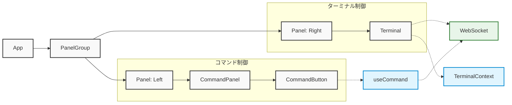

# ExecDock 開発者ガイド

## プロジェクト構成

```
ExecDock/
├── client/                    # フロントエンド
│   ├── index.html            # メインHTML
│   ├── package.json          # フロントエンド依存関係
│   ├── tsconfig.json         # TypeScript設定
│   ├── vite.config.ts        # Vite設定
│   └── src/                  # ソースコード
│       ├── App.tsx           # ルートコンポーネント
│       ├── App.css           # グローバルスタイル
│       ├── main.tsx          # エントリーポイント
│       ├── components/       # Reactコンポーネント
│       │   ├── Command/      # コマンド関連コンポーネント
│       │   │   ├── CommandButton.tsx
│       │   │   └── CommandPanel.tsx
│       │   └── Terminal/     # ターミナル関連コンポーネント
│       │       ├── Terminal.tsx
│       │       └── Terminal.css
│       ├── contexts/         # Reactコンテキスト
│       │   └── TerminalContext.tsx # ターミナル状態管理
│       ├── hooks/           # カスタムフック
│       │   └── useCommand.ts # コマンド実行フック
│       └── types/           # 型定義
│           └── command.ts   # コマンド関連の型
├── server/                   # バックエンド
│   ├── main.ts              # サーバーエントリーポイント
│   └── tsconfig.json        # TypeScript設定
└── tools/                   # 開発ツール
    ├── server.dev.sh        # 開発用スクリプト
    └── server.sh            # ビルド用スクリプト
```

## コンポーネント構成



## データフロー

1. ターミナル初期化フロー
   ```mermaid
   sequenceDiagram
       participant T as Terminal Component
       participant TC as TerminalContext
       participant XTerm as xterm.js
       participant WS as WebSocket
       participant S as Server

       T->>TC: コンテナ要素を渡す
       TC->>XTerm: ターミナルインスタンス作成
       TC->>XTerm: アドオン読み込み
       TC->>WS: WebSocket接続確立
       WS->>S: 初期サイズ情報送信
       S->>WS: 接続確認
   ```

2. コマンド実行フロー
   ```mermaid
   sequenceDiagram
       participant U as User
       participant CB as CommandButton
       participant T as Terminal
       participant TC as TerminalContext
       participant WS as WebSocket
       participant S as Server
       participant PTY as node-pty

       Note over U,PTY: パターン1: コマンドボタンクリック
       U->>CB: クリックイベント
       CB->>TC: executeCommand呼び出し
       TC->>WS: コマンド送信
       WS->>S: メッセージ受信
       S->>PTY: コマンド実行
       PTY->>S: 実行結果
       S->>WS: output送信
       WS->>TC: メッセージ受信
       TC->>T: 結果表示

       Note over U,PTY: パターン2: キーボード入力
       U->>T: コマンド入力
       U->>T: Enterキー押下
       T->>TC: データ送信
       TC->>WS: input送信
       WS->>S: メッセージ受信
       S->>PTY: コマンド実行
       PTY->>S: 実行結果
       S->>WS: output送信
       WS->>TC: メッセージ受信
       TC->>T: 結果表示
   ```

## 主要コンポーネントと機能

### フロントエンドコンポーネント

#### App.tsx
- アプリケーションのルートコンポーネント
- react-resizable-panelsによる画面分割
- コマンド定義の管理
- TerminalProviderによるコンテキスト提供

#### Terminal.tsx
- シンプルなコンテナコンポーネント
- ターミナル要素のマウントポイント提供
- 初期化状態に応じたローディング表示
- すべてのロジックをTerminalContextに委譲

#### TerminalContext.tsx
- ターミナルの状態管理
- xterm.jsインスタンスの初期化と管理
- WebSocket接続の確立と管理
- リサイズ処理の最適化
- 各種アドオンの初期化と管理
  - FitAddon: サイズ自動調整
  - SearchAddon: テキスト検索
  - WebLinksAddon: URLの自動リンク化
  - Unicode11Addon: Unicode 11サポート
  - SerializeAddon: ターミナル状態のシリアライズ

### カスタムフック

#### useCommand.ts
- コマンド実行ロジック
- WebSocket経由でのコマンド送信
- コマンド履歴の管理

### バックエンド（main.ts）
- Express: 静的ファイル配信
- WebSocket: 双方向通信
  - 初期化時のサイズ同期
  - コマンド入力の転送
  - 実行結果の送信
- node-pty: シェルプロセス制御
  - プロセスの生成と管理
  - 入出力のストリーミング

## 開発環境

### フロントエンド開発サーバー（localhost:3000）
- Viteによるホットリロード
- TypeScriptのコンパイル
- アセットの最適化

### バックエンドサーバー（localhost:8999）
- WebSocket通信
- シェルプロセスの管理
- 静的ファイルの配信

## ビルドプロセス

### 開発ビルド（pnpm dev）
1. クライアント開発サーバー起動
   ```bash
   cd client && pnpm dev
   ```
2. バックエンドサーバー起動
   ```bash
   pnpm dev  # ルートディレクトリで実行
   ```

### プロダクションビルド（pnpm build）
1. フロントエンドビルド
   - Viteによる最適化
   - 静的アセットの生成

2. バックエンドビルド
   - esbuildによるバンドル
   - 最適化とminify

## デバッグ

### クライアントサイド
- ブラウザの開発者ツール
  - WebSocketメッセージの監視
  - TerminalContextの状態確認
  - レンダリングパフォーマンス分析
- コンソールログ
  - 接続状態の変更
  - リサイズイベント
  - エラーメッセージ

### サーバーサイド
- WebSocket接続状態
- シェルプロセスの出力
- エラーログ

## 設定オプション

### ターミナル設定（TerminalContext.tsx）
- cols: 初期列数（デフォルト: 80）
- rows: 初期行数（デフォルト: 24）
- fontFamily: フォント（デフォルト: monospace）
- fontSize: フォントサイズ（デフォルト: 14）
- theme: カラーテーマ設定
  - background: 背景色
  - foreground: 文字色
  - cursor: カーソル色
  - selection: 選択範囲の色

### WebSocket設定
- 再接続試行回数: 5回
- 再接続間隔: 指数バックオフ（最大10秒）
- デフォルトポート: 8999
