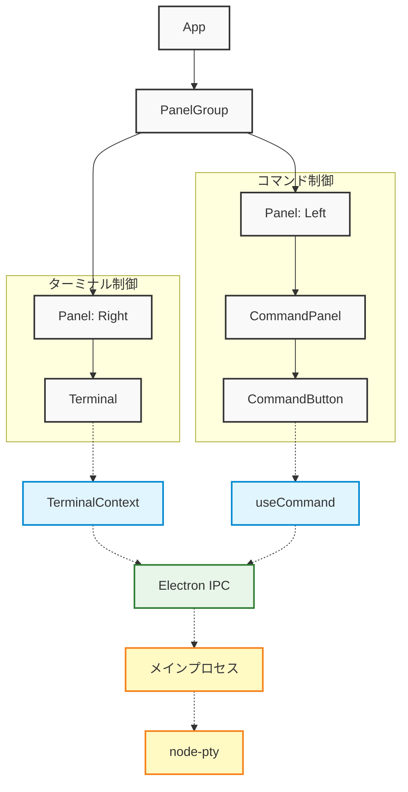

# ExecDock 開発者ガイド

## プロジェクト構成

```
ExecDock/
├── client/                    # フロントエンド（Electron）
│   ├── electron-builder.yml  # Electron Builder設定
│   ├── electron.vite.config.ts # Electron Vite設定
│   ├── package.json          # フロントエンド依存関係
│   ├── tsconfig.json         # TypeScript設定（共通）
│   ├── tsconfig.node.json    # TypeScript設定（Node向け）
│   ├── tsconfig.web.json     # TypeScript設定（Web向け）
│   ├── vite.web.config.ts    # Web向けVite設定
│   ├── build/                # ビルドリソース
│   │   ├── icon.icns         # macOS用アイコン
│   │   ├── icon.ico          # Windows用アイコン
│   │   └── icon.png          # 共通アイコン
│   ├── resources/            # アプリケーションリソース
│   └── src/                  # ソースコード
│       ├── main/             # Electronのメインプロセス
│       │   └── index.ts      # メインエントリーポイント
│       ├── preload/          # プリロードスクリプト
│       │   ├── index.d.ts    # 型定義
│       │   └── index.ts      # プリロードエントリーポイント
│       └── renderer/         # レンダラープロセス（UI層）
│           ├── index.html    # メインHTML
│           └── src/          # フロントエンドコード
│               ├── App.tsx   # ルートコンポーネント
│               ├── main.tsx  # レンダラーエントリーポイント
│               ├── assets/   # 静的アセット
│               ├── components/ # Reactコンポーネント
│               │   ├── Command/ # コマンド関連コンポーネント
│               │   │   ├── CommandButton.tsx
│               │   │   ├── CommandEditModal.tsx
│               │   │   └── CommandPanel.tsx
│               │   └── Terminal/ # ターミナル関連コンポーネント
│               │       ├── Terminal.tsx
│               │       └── Terminal.css
│               ├── contexts/ # Reactコンテキスト
│               │   └── TerminalContext.tsx
│               ├── hooks/    # カスタムフック
│               │   └── useCommand.ts
│               ├── services/ # サービス層
│               │   └── commandTreeStorage.ts
│               └── types/    # 型定義
│                   └── command.ts
├── server/                   # バックエンド（開発環境用）
│   ├── main.ts              # サーバーエントリーポイント
│   └── tsconfig.json        # TypeScript設定
├── tools/                    # 開発ツール
└── package.json              # プロジェクト設定
```

## コンポーネント構成



## データフロー

1. ターミナル初期化フロー
   ```mermaid
   sequenceDiagram
       participant T as Terminal Component
       participant TC as TerminalContext
       participant XTerm as xterm.js
       participant IPC as Electron IPC
       participant MP as メインプロセス
       participant PTY as node-pty

       T->>TC: コンテナ要素を渡す
       TC->>XTerm: ターミナルインスタンス作成
       TC->>XTerm: アドオン読み込み
       TC->>IPC: 初期化メッセージ送信
       IPC->>MP: イベント通知
       MP->>PTY: ターミナルプロセス生成
       MP->>IPC: 接続確認
       IPC->>TC: 準備完了通知
   ```

2. コマンド実行フロー
   ```mermaid
   sequenceDiagram
       participant U as User
       participant CB as CommandButton
       participant T as Terminal
       participant TC as TerminalContext
       participant IPC as Electron IPC
       participant MP as メインプロセス
       participant PTY as node-pty

       Note over U,PTY: パターン1: コマンドボタンクリック
       U->>CB: クリックイベント
       CB->>TC: executeCommand呼び出し
       TC->>IPC: コマンド送信
       IPC->>MP: イベント通知
       MP->>PTY: コマンド実行
       PTY->>MP: 実行結果
       MP->>IPC: output送信
       IPC->>TC: データ受信
       TC->>T: 結果表示

       Note over U,PTY: パターン2: キーボード入力
       U->>T: コマンド入力
       U->>T: Enterキー押下
       T->>TC: データ送信
       TC->>IPC: input送信
       IPC->>MP: イベント通知
       MP->>PTY: コマンド実行
       PTY->>MP: 実行結果
       MP->>IPC: output送信
       IPC->>TC: データ受信
       TC->>T: 結果表示
   ```

## 主要コンポーネントと機能

### Electronアーキテクチャ
- メインプロセス（main/index.ts）
  - アプリケーションライフサイクル管理
  - ウィンドウ作成と管理
  - node-ptyプロセスの制御
  - IPCハンドラの登録
- プリロードスクリプト（preload/index.ts）
  - 安全なIPC通信APIの公開
  - コンテキスト分離
- レンダラープロセス（renderer/）
  - Reactベースのユーザーインターフェース
  - ターミナル表示と操作

### フロントエンドコンポーネント

#### App.tsx
- アプリケーションのルートコンポーネント
- react-resizable-panelsによる画面分割
- コマンド定義の管理
- TerminalProviderによるコンテキスト提供

#### Terminal.tsx
- シンプルなコンテナコンポーネント
- ターミナル要素のマウントポイント提供
- 初期化状態に応じたローディング表示
- すべてのロジックをTerminalContextに委譲

#### CommandEditModal.tsx
- コマンド設定の編集用モーダルダイアログ
- YAML形式でのコマンド定義編集
- ファイルインポート/エクスポート機能
- バリデーション機能とエラー表示
- 設定の永続化（localStorageへの保存）

#### TerminalContext.tsx
- ターミナルの状態管理
- xterm.jsインスタンスの初期化と管理
- Electron IPC通信の確立と管理
- リサイズ処理の最適化
- 各種アドオンの初期化と管理
  - FitAddon: サイズ自動調整
  - SearchAddon: テキスト検索
  - WebLinksAddon: URLの自動リンク化
  - Unicode11Addon: Unicode 11サポート
  - SerializeAddon: ターミナル状態のシリアライズ

### カスタムフック

#### useCommand.ts
- コマンド実行ロジック
- IPC経由でのコマンド送信
- コマンド履歴の管理

### バックエンド（メインプロセス）
- node-pty: シェルプロセス制御
  - プロセスの生成と管理
  - 入出力のストリーミング
- IPC通信
  - イベントハンドリング
  - メッセージ送受信

## 開発環境

### Electronアプリケーション開発
- Electron Viteによるホットリロード
- TypeScriptのコンパイル
- アセットの最適化
- メインプロセスとレンダラープロセスの同時開発

### 開発サーバー（localhost:8999、開発時のみ使用）
- WebSocket通信
- シェルプロセスの管理
- 静的ファイルの配信

## ビルドプロセス

### 依存関係のインストール
```bash
pnpm installall  # 全体の依存関係をインストール
```

### 開発環境の起動
- Electronアプリケーションを起動:
  ```bash
  cd client && pnpm dev
  ```
- 従来の開発モード（WebSocketサーバー + フロントエンド）:
  ```bash
  pnpm devall
  ```

### Electron アプリケーションのビルド
```bash
cd client && pnpm build
```

これにより、`dist`ディレクトリに各プラットフォーム向けの実行可能ファイルが生成されます。

### 対応プラットフォーム
- macOS (x64, arm64)
- Windows
- Linux

## デバッグ

### クライアントサイド（レンダラープロセス）
- Electron DevTools
  - React Devtools統合
  - パフォーマンスプロファイリング
  - ネットワーク監視
- コンソールログ
  - IPCメッセージの追跡
  - ターミナル操作のトレース

### サーバーサイド（メインプロセス）
- console.log出力
- IPC通信ログ
- プロセス状態監視

## 設定オプション

### ターミナル設定（TerminalContext.tsx）
- cols: 初期列数（デフォルト: 80）
- rows: 初期行数（デフォルト: 24）
- fontFamily: フォント（デフォルト: monospace）
- fontSize: フォントサイズ（デフォルト: 14）
- theme: カラーテーマ設定
  - background: 背景色
  - foreground: 文字色
  - cursor: カーソル色
  - selection: 選択範囲の色

### Electron設定
- ウィンドウサイズ: 初期サイズと最小サイズ
- アプリケーションメニュー
- システムトレイ統合
- ショートカットキー
