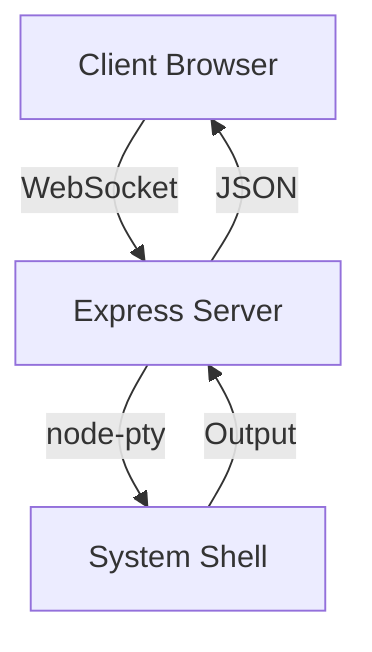

# ExecDock 開発者ガイド

## プロジェクト構成

```
ExecDock/
├── client/              # フロントエンド
│   ├── index.html      # メインHTML
│   ├── xterm-profile.ts # ターミナル設定
│   ├── tsconfig.json   # TypeScript設定
│   └── vite.config.ts  # Vite設定
├── server/             # バックエンド
│   ├── main.ts        # サーバーエントリーポイント
│   └── tsconfig.json  # TypeScript設定
└── tools/             # 開発ツール
    ├── server.dev.sh  # 開発用スクリプト
    └── server.sh      # ビルド用スクリプト
```

## アーキテクチャ概要



## データフロー

1. クライアント入力
   - ユーザー入力 → xterm.js → WebSocket → サーバー → node-pty

2. シェル出力
   - シェル → node-pty → WebSocket → xterm.js → 画面表示

## 主要コンポーネント

### クライアントサイド（xterm-profile.ts）
- Terminal (@xterm/xterm): メインターミナルインスタンス
- アドオン:
  - @xterm/addon-fit: 画面サイズ調整
  - @xterm/addon-search: テキスト検索
  - @xterm/addon-web-links: URLリンク化
  - @xterm/addon-unicode11: Unicode対応
  - @xterm/addon-serialize: 状態シリアライズ

### サーバーサイド（main.ts）
- Express 5: 静的ファイル配信
- WebSocket: 双方向通信
- node-pty 1.0.0: シェルプロセス制御
- TypeScript 5.8.3: 型システム

## 開発時の処理フロー（pnpm dev）

1. 環境準備
   - NODE_ENV=development に設定
   - .cache ディレクトリの削除（クリーンビルド）

2. フロントエンドビルド
   - client/ ディレクトリでViteによるビルド
   - 開発用の最適化されたアセット生成

3. バックエンドビルド
   - esbuildによるサーバーコードのビルド
   - オプション:
     - platform=node: Node.js向けにビルド
     - minify: コードの最小化
     - format=cjs: CommonJS形式で出力
     - outfile=./.cache/dist/main.js: 開発用ディレクトリに出力

4. サーバー起動
   - ビルドされたサーバーコードを実行
   - 開発モードで動作（ホットリロードなど）

## プロダクションビルド処理（pnpm build）

1. 環境設定
   - NODE_ENV=prod に設定

2. フロントエンドビルド
   - client/ ディレクトリでViteによる本番用ビルド
   - 最適化された静的アセットの生成

3. バックエンドビルド
   - esbuildによるサーバーコードの本番用ビルド
   - オプション:
     - platform=node: Node.js向けにビルド
     - minify: コードの最小化
     - format=cjs: CommonJS形式で出力
     - outfile=./dist/main.js: 本番用ディレクトリに出力

## デバッグとトラブルシューティング

- WebSocketの接続状態はブラウザコンソールで確認可能
- サーバーサイドログはターミナルに出力
- クライアントサイドデバッグ情報はコンソールに出力

## 設定オプション

### ターミナル設定
- cols: 初期列数（デフォルト: 80）
- rows: 初期行数（デフォルト: 24）
- その他のxtermオプションも利用可能

### サーバー設定
- PORT: サーバーポート（デフォルト: 8999）
- NODE_ENV: 実行環境（development/prod）
  - development: 開発用ビルド（.cache/dist/に出力）
  - prod: 本番用ビルド（dist/に出力）
